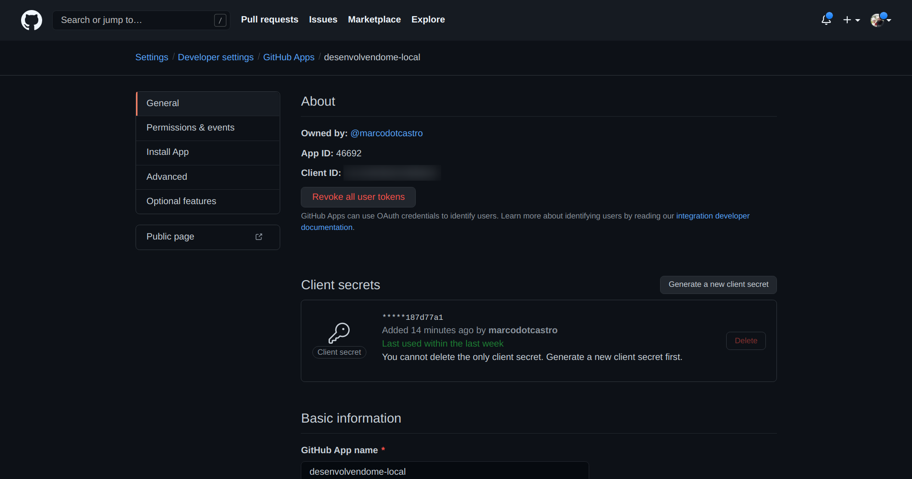
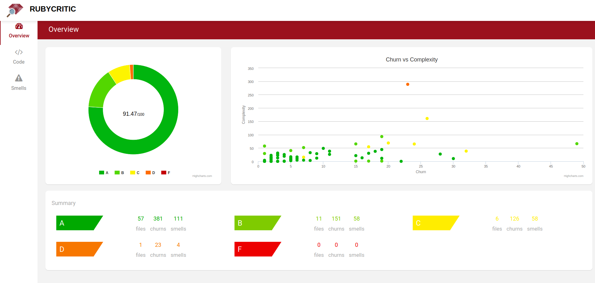
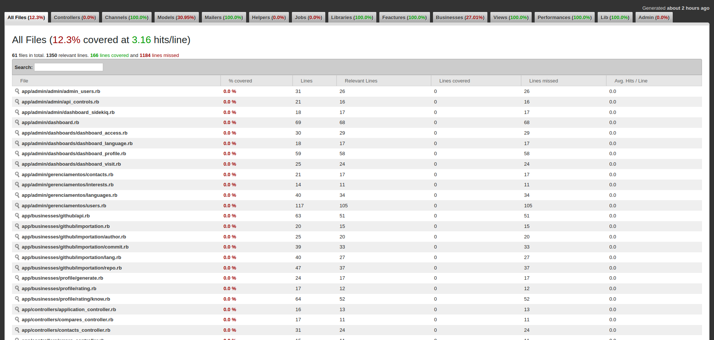

# Informações Negociais

Video de Apresentação do Negócio, clique na imagem

[](http://www.youtube.com/watch?v=qwTtnZBI7LM)

[Apresentação Completa no Prezi](https://prezi.com/p/vvozg6zg_enz/?present=1)

## Principais Funcionalidades

Video de Apresentação das Funcionalidades, clique na imagem

[](http://www.youtube.com/watch?v=QeYfnrnRKes)

# Informações Técnicas

## Variáveis de Ambiente

### Github
#### Adicionar o Github Client
```
ENV['GITHUB_CLIENT_ID']
ENV['GITHUB_CLIENT_SECRET']
```
#### Onde pegar o Github Client


#### Adicionar Access Token no banco de dados
```
ApiControl.create(key: [ACCESS_TOKEN], description: "Chave do usuário marcodotcastro, limite de 5000 requests por hora")
```
#### Onde pegar o Github Access Token para API


## Running

> Clone o projeto

> Instale o ruby 2.6.5

> Agora execute

```
bundle install
rails db:create
rails db:migrate
rails db:seed 
rails s
```

## Quanlidade

### Qualidade de Código
```
shell> rubycritic app
```
Acesse: HOME_PROJECT/tmp/rubycritic/overview.html


### Cobertura de Código

```
shell> rspec spec
```

Acesse: HOME_PROJECT/coverage/index.html


## Infraestrutura
- [Github](https://developer.github.com/v3/)

